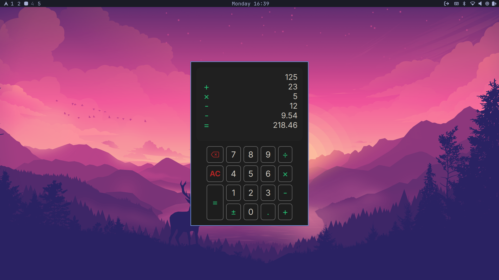

# Calculator

A modern, fast, and responsive desktop calculator built with **C++** and **Qt6 QML**. 

This project demonstrates a clean Model-View architecture, separating the heavy mathematical logic (C++) from a smooth, declarative user interface (QML) using modern Qt6 module practices.



## Table of Contents
- [Features](#features)
- [Keyboard Shortcuts](#keyboard-shortcuts)
- [Project Structure](#project-structure)
- [Prerequisites](#prerequisites)
- [Building & Installation](#building--installation)
- [To-Do List](#to-do-list)
- [License](#license)

## Features

* **Advanced Layout Engine:** A dynamic history list that perfectly aligns mathematical operators in a center column, while keeping numbers right-aligned. Long numbers automatically become horizontally scrollable to prevent UI breaking.
* **Modern Qt6 Architecture:** Built using Qt6's updated QML Module system (`qt_add_qml_module`) and declarative type registration (`QML_ELEMENT`, `QML_ANONYMOUS`).
* **Efficient Memory Management:** Uses standard Qt Object Trees and `QAbstractListModel` for high-performance UI rendering without memory leaks.
* **Linux Ready:** Includes fully compliant FreeDesktop `.desktop`, SVG icons, and `.appdata.xml` files for seamless integration into Linux application launchers and software centers.

## Keyboard Shortcuts

This calculator features global shortcut listeners, meaning you do not need to click the app to focus it before typing.

| Key | Action |
| :--- | :--- |
| `0`-`9`, `.` | Enter numbers and decimals |
| `+`, `-`, `*`, `/` | Standard mathematical operations |
| `=`, `Enter`, `Return`| Calculate result |
| `Esc` | All Clear (AC) |
| `Backspace` | Delete last digit |
| `Up Arrow`, `k` | Scroll history list up |
| `Down Arrow`, `j` | Scroll history list down |

## Project Structure

```text
├── CMakeLists.txt           # Modern Qt6 CMake configuration
├── assets/
│   ├── linux/               # Linux desktop and appdata files
│   └── backspace.svg        # UI Icons
├── qml/                     # QML Frontend
│   ├── Application.qml      # Main Application Window
│   ├── Display.qml          # Screen and History ListView
│   ├── NumPad.qml           # Grid layout for buttons
│   └── components/          # Reusable UI components (Buttons, etc.)
└── src/                     # C++ Backend
    ├── main.cpp             # Application entry point & property injection
    ├── CalculatorEngine.h   # Core math logic and Q_PROPERTY definitions
    ├── CalculatorEngine.cpp
    ├── Logger.h             # Debug logging utility
    └── Logger.cpp
```

## Prerequisites

To build and run this project, you will need:

- Qt 6.2 or higher (with the QtDeclarative/QML modules installed)
- CMake 3.20 or higher
- A C++23 compatible compiler (GCC, Clang, or MSVC)

## Building from Source

This project uses CMake. You can build it easily from the command line:

``` bash
# 1. Clone the repository
git clone [https://github.com/ilikeblue/Calculator.git](https://github.com/ilikeblue/Calculator.git)
cd Calculator

# 2. Configure and Build the application
cmake -B build/ -DCMAKE_BUILD_TYPE=Release -DCMAKE_INSTALL_PREFIX=/usr -G Ninja # Ninja is optional but recommended
cmake --build build/

# 3. Install the application
sudo cmake --install build/

# 4. Run the application
Calculator
```

Or if you have `make`:
``` bash
# 1. Clone the repository
git clone [https://github.com/ilikeblue/Calculator.git](https://github.com/ilikeblue/Calculator.git)
cd Calculator

# 2. Build and Install the application
sudo make release

# 3. Run the application
Calculator
```

## To-Do List

- [x] Core arithmetic engine setup
- [x] Model-View history list architecture
- [x] Global keyboard shortcut integration
- [x] Dynamic text scrolling for long numbers
- [x] Linux FreeDesktop integration (`.desktop` & `appdata`)
- [x] Environment-variable based logging levels (`spdlog`)
- [ ] Dark/Light system theme detection
- [ ] Scientific calculator layout/mode
- [ ] Persist calculation history between sessions (SQLite)
- [ ] Windows/macOS installer packaging
- [ ] Uninstall app script

## License

This project is licensed under the MIT License - see the [LICENSE.md](LICENSE.md) file for details.
